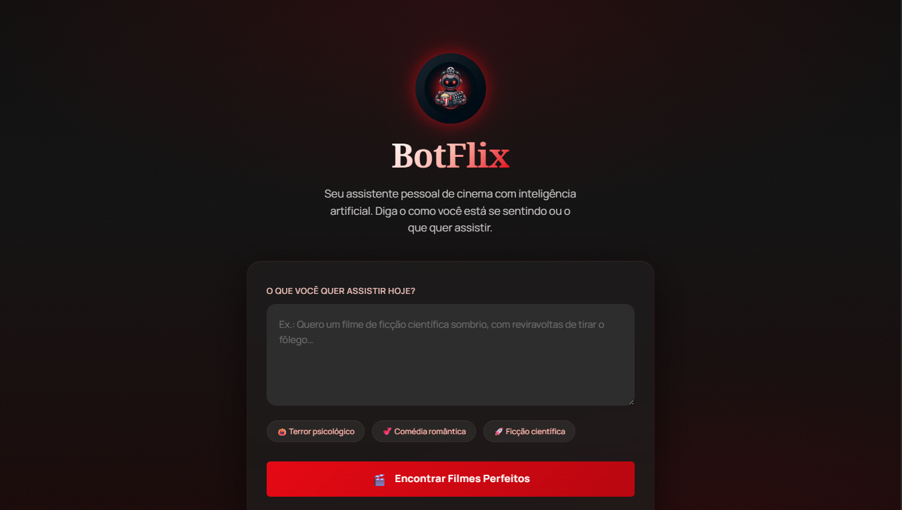
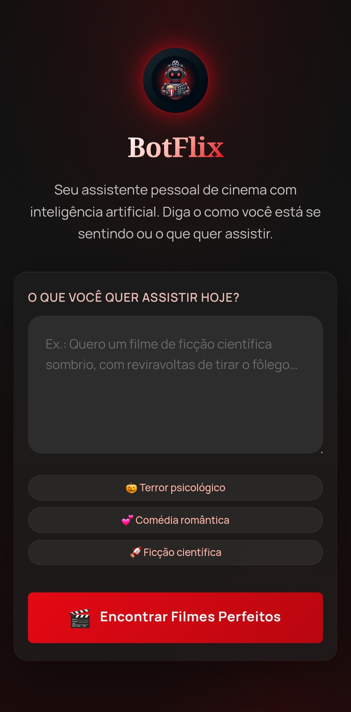

<div align="center">

# 🎬 BotFlix

**Um recomendador de filmes com IA — descreva seu humor e receba uma indicação personalizada com pôster, sinopse e onde assistir.**



[](https://tuliovitor.github.io/botflix)
[](https://developer.mozilla.org/pt-BR/docs/Web/HTML)
[](https://developer.mozilla.org/pt-BR/docs/Web/CSS)
[](https://developer.mozilla.org/pt-BR/docs/Web/JavaScript)
[](https://n8n.io)

</div>

---

## 📌 Sobre o projeto

O **BotFlix** é um assistente de cinema com IA desenvolvido individualmente do zero. O usuário descreve o que quer assistir — ou como está se sentindo — e recebe uma recomendação personalizada com pôster, sinopse, justificativa da indicação e links de onde assistir.

O projeto integra um webhook N8N que roteia o texto para um LLM e retorna os dados estruturados do filme. Quando o webhook não está disponível, o app entra automaticamente em **modo demo**: detecta palavras-chave no texto e retorna filmes pré-selecionados, mantendo a experiência funcional em qualquer ambiente.

---

## 🎬 Demonstração

| Desktop | Mobile |
|---|---|
|  |  |

---

## ✨ Funcionalidades

- **Input livre** — o usuário descreve o filme que quer assistir com suas próprias palavras
- **Chips de sugestão** — três atalhos de gênero que preenchem o textarea automaticamente com prompt otimizado
- **Integração com N8N** — webhook recebe o texto e retorna `title`, `year`, `genre`, `synopsis`, `why_watch`, `poster_url` e `streaming`
- **Modo demo inteligente** — quando o webhook não está configurado, detecta palavras-chave (terror, ficção, comédia) e retorna filmes reais pré-selecionados
- **Pôster com fallback em SVG** — se a URL do pôster falhar, gera um placeholder visualmente consistente com o título do filme via SVG data URI
- **Seção "Onde Assistir"** — renderiza logos clicáveis de plataformas de streaming retornadas pela IA
- **Estados de UI explícitos** — loading com skeleton, erro com botão de retry e resultado com animação de entrada
- **Shake animation no textarea** — injetada via JS quando o usuário tenta enviar sem digitar nada
- **Atalho de teclado** — `Ctrl+Enter` submete o formulário
- **Totalmente responsivo** — layout adaptado para mobile e desktop

---

## 🧱 Stack

| Tecnologia | Uso |
|---|---|
| HTML5 semântico | Estrutura com `header`, `main`, `section` e `article` |
| CSS3 com custom properties | Design system dark, glassmorphism no card e animações |
| JavaScript vanilla | Toda a lógica: estados, webhook, demo data e fallbacks |
| N8N | Webhook que recebe o prompt e retorna os dados do filme via LLM |
| TMDB | Fonte das URLs de pôster usadas nos dados de demonstração |

> Nenhuma dependência de frontend. Zero `npm install`. Um único `index.html`.

---

## 🗂️ Estrutura do projeto

```
botflix/
├── index.html      # Estrutura completa com todos os estados de UI
├── scripts.js      # Lógica: chips, webhook, estados, demo data, fallbacks
├── styles.css      # Design system dark, glassmorphism e responsividade
└── img/
    └── mascot.webp # Mascote robô cinéfilo usado no header e favicon
```

---

## 🧠 Decisões técnicas

### Modo demo com detecção de palavras-chave

Quando o webhook não está configurado, o app não simplesmente retorna um filme aleatório — ele lê o texto do usuário e tenta corresponder ao gênero pedido:

```javascript
function getDemoData(userText) {
  const lower = userText.toLowerCase();
  if (lower.includes('terror') || lower.includes('medo') || lower.includes('horror')) {
    return { title: 'Hereditário', genre: 'Terror Psicológico', ... };
  }
  return demos[Math.floor(Math.random() * demos.length)];
}
```

Isso garante que mesmo sem IA conectada, a demo sinta que está respondendo ao que o usuário pediu.

---

### Pôster fallback gerado em SVG puro

Se a URL do pôster retornada pela IA falhar (imagem removida, CORS, etc.), o app gera um placeholder visual com o título do filme via SVG data URI — sem depender de nenhum serviço externo:

```javascript
function generatePlaceholderPoster(title) {
  const svg = `<svg ...>
    <text ...>${escapeXml(displayTitle)}</text>
  </svg>`;
  return 'data:image/svg+xml;charset=utf-8,' + encodeURIComponent(svg.trim());
}
```

O título é passado por `escapeXml()` antes de entrar no SVG, evitando quebras com caracteres como `&`, `<` e `"`.

---

### Shake animation injetada via JavaScript

A animação de erro no textarea não está no CSS estático — ela é criada e injetada no `<head>` em tempo de execução. Isso evita que a animação fique "presa" no estado ativo entre cliques:

```javascript
// A animação é resetada a cada clique forçando um reflow
userPrompt.style.animation = 'none';
void userPrompt.offsetWidth; // força reflow
userPrompt.style.animation = 'shakeInput 0.5s ease';
```

O `void userPrompt.offsetWidth` é o truque para forçar o browser a "esquecer" o estado atual da animação antes de reativá-la.

---

### Três estados de UI gerenciados por classes CSS

Loading, erro e resultado são controlados via `.classList.add('active')` / `.classList.remove('active')`, mantendo o HTML limpo e o CSS no controle da visibilidade. A função `showResult()` força um reflow antes de reativar a classe de animação do card:

```javascript
resultSection.classList.remove('active');
void resultSection.offsetWidth; // reflow
resultSection.classList.add('active');
```

O mesmo padrão de reflow usado na shake animation garante que o card sempre entre com a animação completa, mesmo sendo chamado múltiplas vezes.

---

### Escaping de XML no SVG gerado

O título do filme pode conter `&`, `<`, `>` ou aspas — caracteres que quebram um SVG inline. A função `escapeXml()` trata todos esses casos antes de interpolar no template:

```javascript
function escapeXml(str) {
  return str.replace(/&/g, '&amp;')
            .replace(/</g, '&lt;')
            .replace(/>/g, '&gt;')
            .replace(/"/g, '&quot;')
            .replace(/'/g, '&apos;');
}
```

---

## ⚙️ Configurando o N8N

O webhook recebe um `POST` com `{ message: string }` e deve retornar:

```json
{
  "title": "Interestelar",
  "year": "2014",
  "genre": "Ficção Científica",
  "synopsis": "Em um futuro onde...",
  "why_watch": "Uma experiência cinematográfica...",
  "poster_url": "https://image.tmdb.org/t/p/w500/...",
  "streaming": [
    { "name": "Netflix", "logo": "https://...", "link": "https://netflix.com" }
  ]
}
```

Para conectar ao seu N8N, substitua a URL no topo de `scripts.js`:

```javascript
const N8N_WEBHOOK_URL = 'https://seu-usuario.app.n8n.cloud/webhook/buscar-filme';
```

Sem configuração, o app funciona automaticamente no modo demo.

---

## 📈 Processo de desenvolvimento

| Etapa | O que foi feito |
|---|---|
| 01 | Design system dark e layout com glassmorphism no card |
| 02 | Estrutura HTML com todos os estados de UI (loading, erro, resultado) |
| 03 | Chips de sugestão com preenchimento do textarea e feedback de clique |
| 04 | Integração com N8N webhook e tratamento de erros HTTP |
| 05 | Renderização do card de resultado com pôster, badges e sinopse |
| 06 | Fallback de pôster em SVG com escaping de XML |
| 07 | Seção "Onde Assistir" com logos clicáveis de streaming |
| 08 | Modo demo com detecção de palavras-chave por gênero |
| 09 | Shake animation injetada via JS e atalho `Ctrl+Enter` |
| 10 | Responsividade completa para mobile |

---

## 💡 O que eu aprenderia diferente

- Teria definido o contrato de resposta do N8N (`title`, `year`, `genre`, etc.) antes de começar o HTML — construir a UI sem saber o shape dos dados exigiu ajustar os campos várias vezes
- Teria criado o modo demo desde o início, em paralelo com a integração real, para testar o fluxo sem depender do webhook estar funcionando
- Teria extraído os três estados de UI (loading, erro, resultado) para funções de estado mais explícitas desde o início, em vez de chamar `classList` diretamente em vários lugares

---

## 👨‍💻 Autor

**TULIO VITOR**

[](https://linkedin.com/in/tuliovitor)
[](https://github.com/tuliovitor)

---

<div align="center">

Feito com muito ☕ e muito 🎬

</div>
